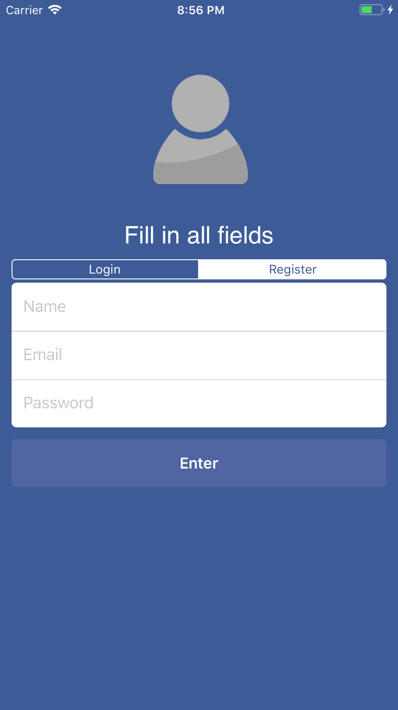
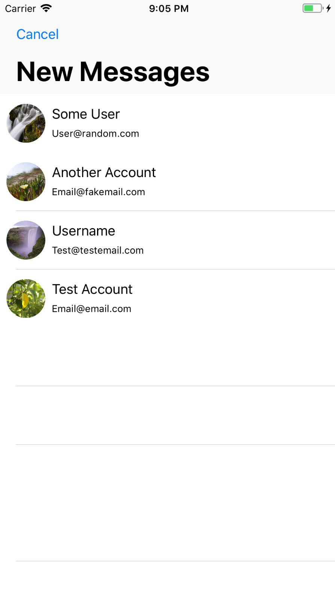
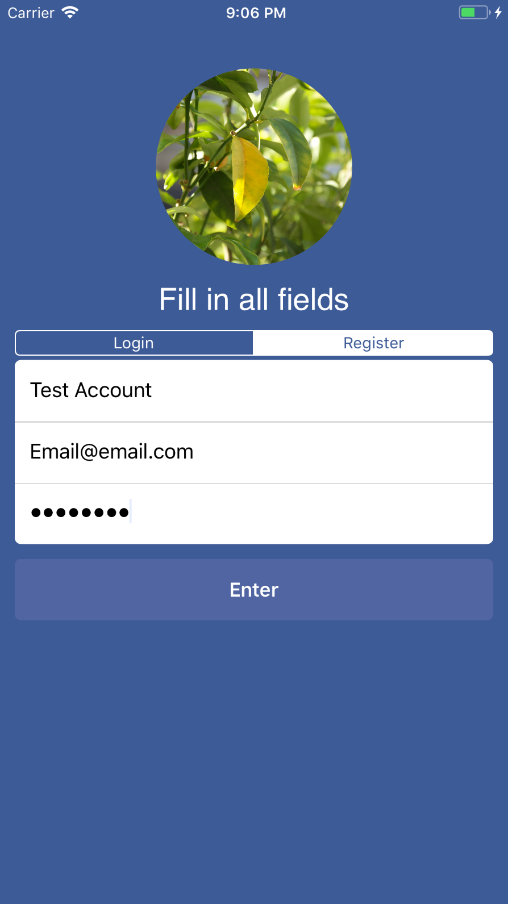
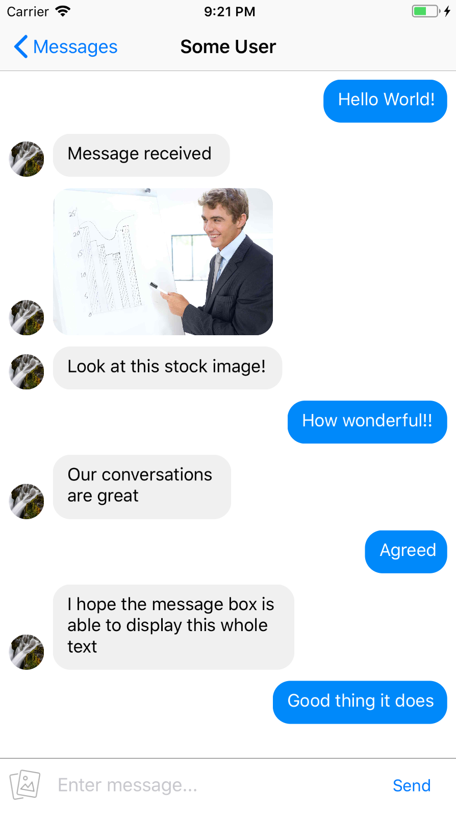
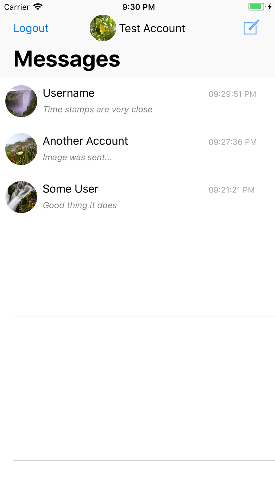

# iOS-Messaging-App

A project I have worked on for educational purposes since I was very interested in improving iOS development skills.

You can go to your Firebase Console and download the "GoogleService-Info.plist" then drag it into your Xcode project
once you have it open

# Some Pictures of the Project

